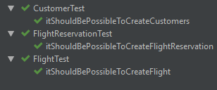

# Teaching-HEIGVD-AMT-2019-Project-One

## Ce que nous avons implémenté

Pour ce labo, voici ce que nous avons implémenté:

Côté fonctionnel:
Notre application est basé sur une agence de consultation de vols simplifié:
- L'utilisateur peut regarder quels vols il y a depuis, vers ou entre deux villes
- Il aura un espace personnel dans lequel il pourra consulter les vols qu'il aura réservé et les décommander
- Le modèle est simple, nous avons 3 tables: customer qui représente l'utilisateur, flight qui représente les vols et flightReservation qui représente les vols qu'un utilisateur a réservé
- Les vols d'un utilisateur se trouvent sur la page "/profile"
- L'utilisateur peut consulter les vols sur la page "/home"

## Ce qui fonctionne

- Le login et l'enregistrement d'une personne dans l'application
- La base de donnée est fonctionnelle et bien accessible par le serveur
- Les fonctions CRUD des DAO fonctionnent correctement
- Le SecurityFilter

## Bugs et contraintes d'utilisation

### Bugs

Une fois authentifié, la variable de session supposée être transmise depuis le login vers les pages suivantes ne l'est pas. La partie dans le login
```
    Customer customer = customerManager.getCustomerByPseudo(username);
    HttpSession session = req.getSession();
    session.setAttribute("customer", customer);
    resp.sendRedirect(req.getContextPath() + "/home");
```
ne permet apparemment pas aux pages suivantes d'accéder à l'attribut customer de la variable session.

Ainsi on a pu voir que le Filter fonctionne bien; c'est-à-dire qu'on ne peut accéder à certaines pages si l'on est pas authentifié (donc que l'attribut customer de la variable session est bien initialisée)
En contrepartie, on ne peut donc pas accéder à la suite de l'application, ce qui fait qu'on n'a pas pu tester toutes les fonctionnalités de l'appli.
Il peut donc subsister des bugs inconnus, certainement dans la partie pagination.

### Contraintes d'utilisation

Bien s'enregistrer avant de se log, il peut y avoir des problèmes de stabilité côté serveur si l'on essaie de se logger avec un utilisateur inconnu.

## Tests et stratégie

Nous avions l'intention d'implémenté 4 types de tests.

### JUnit

Nous avons utilisé JUnit pour tester les models. Ce sont des tests simples pour vérifier le bon fonctionnement des classes.


### Archillian

Nous avons utilisé Archillian pour tester les DAO.

Pour faire fonctionner Archillian, nous utilisons une topologie différente. Il faut aller dans ```\topology\dockerAequilian\topologies``` et faire un ``docker-compose up --build``pour lancer les containers permettant le fonctionnement d'Archilian. Puis clic droit sur le dossier test dans Intelliji pour lancer les tests Archillian.

Malheuresement nous n'avons pas réussi à finir les tests dans les temps.

Archillian n'est pas agréable à utiliser. Il est lent à effectuer les tests et nécessite une configuration particulière pour son fonctionnement.

### Mockito

Nous avions pensé utilisé Mockito pour les tests sur les parties business et presentation.

### JMeter

Nous comptions utiliser JMeter pour tester la pagination et les tests de charges.
